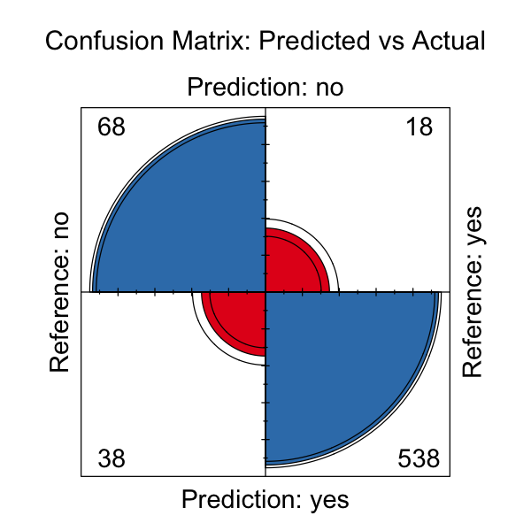

# celiac-prediction

**Goal.** Build an interpretable model to predict celiac disease diagnosis from demographic, clinical, and immunological variables.

**Data.** 2,206 patients × 15 variables (Age, Gender, IgA/IgG/IgM, symptoms, diabetes status, etc.).

**Methods.**
- Cleaning: reconciled `Diabetes` + `Diabetes.Type` → `Diabetes_Status`; factor encoding; dropped `Marsh`.
- Model: Logistic regression (binomial GLM) with 70/30 train–test split.
- Metrics: Accuracy, confusion matrix, ROC/AUC.

**Key findings (test set).**
- Strong predictors: **IgA**, **IgM**, **Diabetes (Type 1/2)**, **Abdominal pain**.
- Weaker/non-sig: Age, Gender, IgG, Sticky stool, Weight loss.
- (Add your **Accuracy** and **AUC** here.)

**Full report (PDF):** [`report/Celiac_Report.pdf`](report/Celiac_Report.pdf)

## Data

The dataset comes from Kaggle:  
[Celiac Disease (Coeliac Disease) Dataset](https://www.kaggle.com/datasets/jackwin07/celiac-disease-coeliac-disease)

It contains 2,206 patient records with 15 clinical and laboratory features.

### Confusion Matrix
